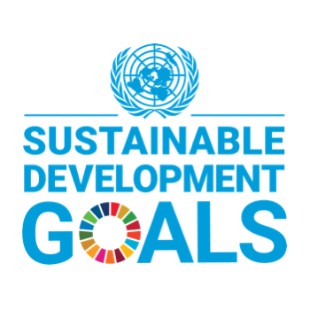
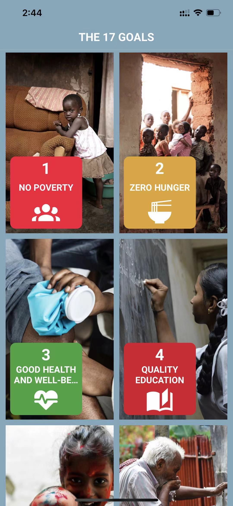
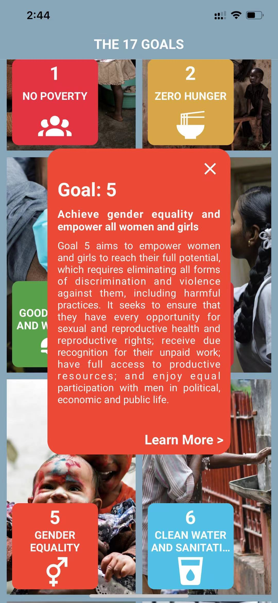
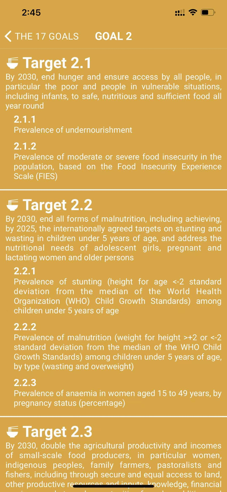
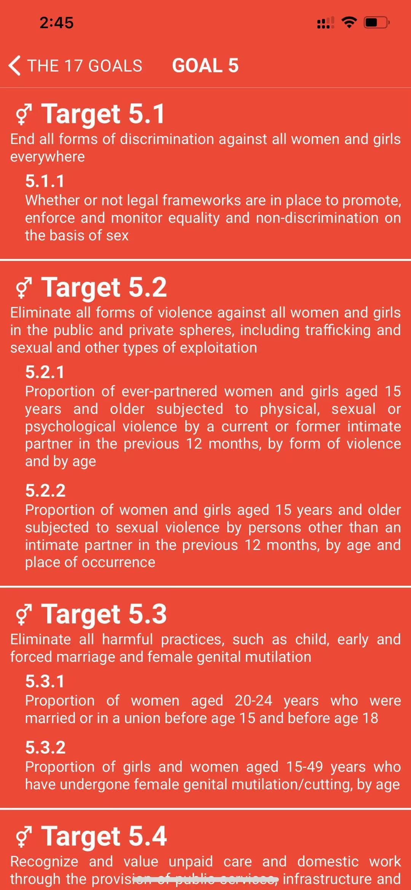
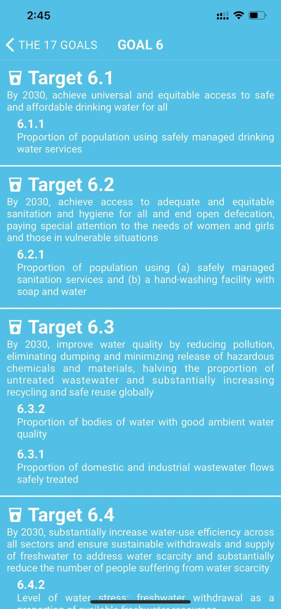

<!-- PROJECT LOGO -->
 

  

  <h1 align="center" >Sustainable Development Goals</h1>

  

    This is a mobile application for <a href="https://sdgs.un.org/goals"><strong>THE 17 GOALS OF SDG</strong></a> implemented with React Native.
  

## Description

This is a [React Native](https://reactnative.dev/) mobile application. Goals, Targets and Indicators are loaded through [United Nations Statistics Division SDG API](https://unstats.un.org/SDGAPI/swagger/#!/Target/V1SdgTargetDataGet).

## ScreenShots

  
  
  
  
  
  

    <a href="https://expo.io/@sonia-s/Felix_Mobile_GoalApp"><strong>Play with it on Expo</strong></a>
  

## Usage
1. cd to the current dictionary and run following command to install required packages:

`npm install` or `yarn`

2. Use following command to run this app on Expo Metro Bundler:

`npm start`
